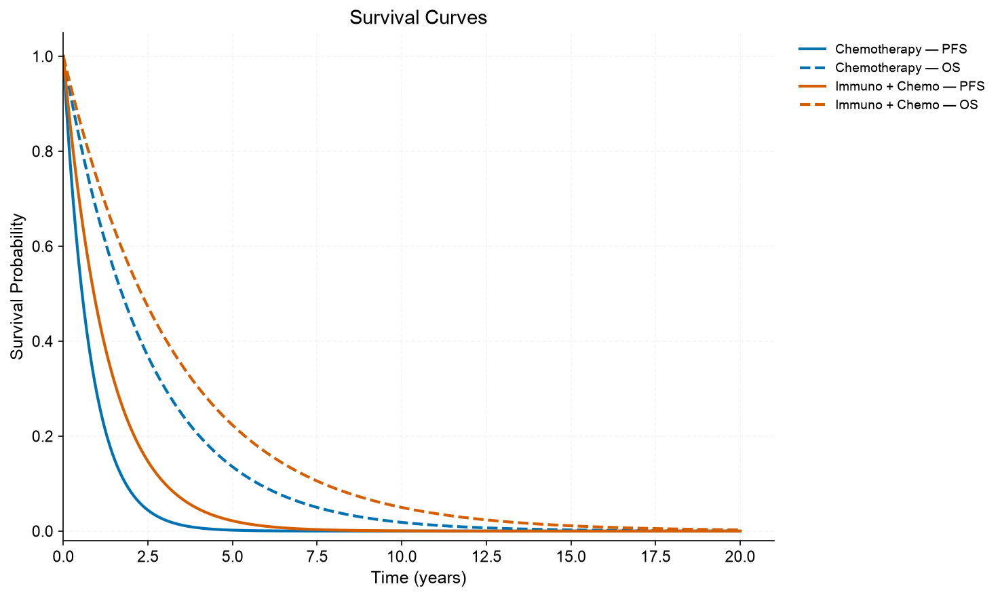
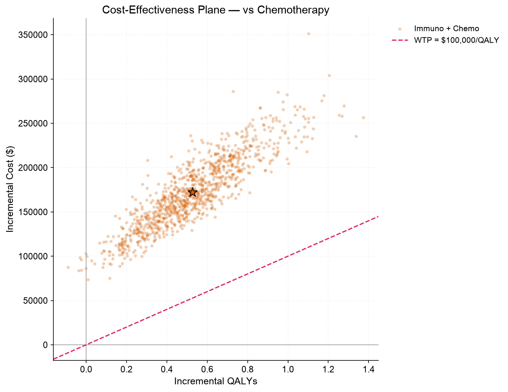
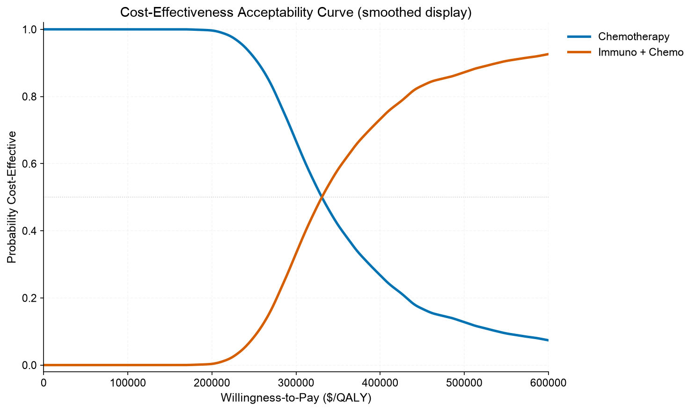
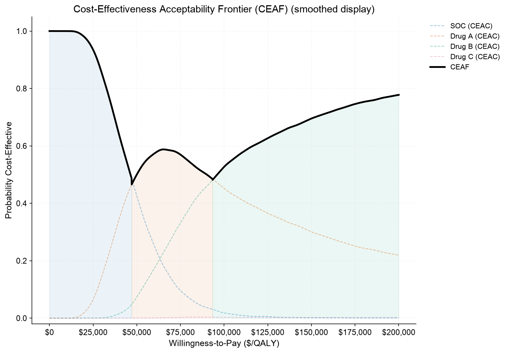

# PyHEOR

用于卫生经济学建模与成本效果分析的 Python 框架。

[English](README.md) · [Français](README_fr.md)

## 结果展示

以下图形由仓库中的模拟示例生成，点击图片可查看原图。

| 生存建模 | 参数不确定性 |
|:---:|:---:|
| [](examples/psm_oncology/figures/survival_curves.png) | [](examples/psm_oncology/figures/ce_scatter.png) |
| 比较不同策略的 PFS 与 OS 拟合曲线。 | 展示 PSA 抽样中的增量成本与增量 QALY。 |
| **成本效果可接受曲线（CEAC）** | **多策略决策分析（CEAF）** |
| [](examples/psm_oncology/figures/ceac.png) | [](examples/multi_strategy_comparison/figures/ceaf.png) |
| 查看成本效果概率随支付意愿阈值的变化。 | 展示推荐策略及其具有成本效果的概率。 |

运行[肿瘤 PSM](examples/psm_oncology/example.py)和[多策略比较](examples/multi_strategy_comparison/example.py)示例即可复现。CEAC/CEAF 图中已标注显示平滑；分析和导出保留原始概率。

## 安装

```bash
pip install -e .
```

Python 3.9+；依赖 NumPy、SciPy、pandas、matplotlib、openpyxl。

## 模型

| 模型 | 时间 | 成本与效果 |
|---|---|---|
| `MarkovModel` | 显式固定周期 | 队列状态及转移收益 |
| `PSMModel` | 显式固定周期 | 生存曲线决定占比，可选 Terminal 临终记账状态 |
| `MicroSimModel` | 显式固定周期 | 个体状态及转移收益，支持异质性与共同随机数 |
| `DESModel` | 声明单位的连续时间 | 状态收益率按时间积分，事件收益按实际时间计入 |

支持基线分析、敏感性分析、策略比较、CE 平面、CEAC、状态轨迹及报告。DES 保留基线和 PSA 分析。

## 快速开始

状态成本与 QALY 输入是**每周期量**，贴现率是**每周期有效率**。第一周期不贴现。效用权重通过 `qaly()` 显式转换为 QALY，月周期的结果仍然是 QALY。

```python
import pyheor as ph

cycle = ph.Cycle(1, "month")
model = ph.MarkovModel(
    states=["Alive", "Dead"], strategies=["SOC", "TRT"],
    n_cycles=120, cycle=cycle, method="life-table",
    dr_cost=ph.rescale_discount_rate(.03, ph.Cycle(1, "year"), cycle),
    dr_qaly=ph.rescale_discount_rate(.03, ph.Cycle(1, "year"), cycle),
)
model.add_param("u_alive", base=.8, dist=ph.Beta(mean=.8, sd=.05))
model.set_transitions("SOC", [[.98, .02], [0, 1]])
model.set_transitions("TRT", [[.985, .015], [0, 1]])
model.set_state_cost("care", {
    "SOC": {"Alive": 1000}, "TRT": {"Alive": 1500},
})
model.set_state_qaly("health", {
    "Alive": lambda p, k: ph.qaly(p["u_alive"], cycle),
})
model.set_starting_cost("test", 200)
model.set_state_cost("loading", {"Alive": 500}, cycles=1)
model.set_transition_cost("terminal", "Alive", "Dead", 10000)

base = model.run_base_case()
print(base.summary())
print(base.icer())
psa = model.run_psa(n_sim=100, seed=42)
```

## 成本和效果

成本和 QALY 具有对应的状态、起始一次性、入态、转移、自定义接口。状态收益通过 `cycles=1` 或周期列表限定发生时间；回调支持参数、从 1 开始的周期编号以及患者属性。起始一次性收益不加权；第一周期状态收益按占比加权，两者含义不同。

`method` 为 `beginning`、`end` 或默认 `life-table`，状态计数及转移流量矫正遵循 heemod。PSM 无法从 PFS/OS 曲线识别每对状态的转移流量，因此不支持入态/转移收益，可按文档使用 Terminal 临终费用记账。

## 实用工具

所有工具均可通过 `import pyheor as ph` 使用。模型不会自动猜测输入单位；下面的工具帮助显式完成换算。

| 工具 | 用途与输入口径 |
|---|---|
| `Cycle(length, unit)` | 定义周期；`.years` 返回年数，`.in_unit(unit)` 换算时长，`.time(k, unit=...)` 返回第 k 个周期边界的时间 |
| `qaly(utility, duration, unit=None)` | 效用权重乘持续年数，得到 QALY；时长可用 `Cycle`，或数值加显式单位；支持效用数组及效用减损 |
| `rescale_discount_rate(rate, from_period, to_period)` | 换算有效贴现率：`(1 + rate) ** (目标时长 / 原时长) - 1`；两个时长均用 `Cycle`，或均用同单位数值 |
| `rescale_survival(curve, from_unit=..., to_period=...)` | 把拟合曲线的时间单位换成模型周期；同步转换风险率和分位时间 |
| `from_flexsurv(distribution, **parameters)` | 用 R/flexsurv 的自然尺度参数构建生存分布；不接收优化器系数，也不自动转换时间单位 |
| `ScaledSurvival(curve, factor)` | 底层时间缩放：`S_new(t) = S_old(t * factor)`；已知单位时优先使用 `rescale_survival()` |
| `ProportionalHazards(curve, hr)` | 应用比例风险效应：`S_new(t) = S_old(t) ** hr`；HR 不改变时间单位 |
| `AcceleratedFailureTime(curve, af)` | 应用生存时间倍数：`S_new(t) = S_old(t / af)`；例如 `af=1.2` 将生存时间延长 20% |
| `Beta`、`Gamma`、`LogNormal` 的 `mean`/`sd` | 从原尺度均值和标准差自动推导抽样分布参数；`LogNormal` 也接受 `meanlog`/`sdlog` |
| `C` | 自动补足转移矩阵一行的剩余概率；每行最多一个，例如 `[ph.C, .02]` 中 `C=.98` |

```python
import pyheor as ph

month = ph.Cycle(1, "month")
year = ph.Cycle(1, "year")
monthly_qaly = ph.qaly(.8, month)                    # 0.066667 QALY
monthly_cost = 12000 * month.years                  # 年成本 → 月成本：1000
monthly_dr = ph.rescale_discount_rate(.03, year, month)
three_month_qaly = ph.qaly(.8, 3, unit="month")      # 0.2 QALY
month_boundaries = month.time([0, 1, 12], unit="year")

# 这条 Weibull 曲线拟合时以年为单位；换算后 t=1 表示一个月。
curve = ph.from_flexsurv("weibull", shape=1.3, scale=1.5)
monthly_curve = ph.rescale_survival(
    curve, from_unit="year", to_period=month,
)
treated_curve = ph.ProportionalHazards(monthly_curve, hr=.75)
```

`from_flexsurv()` 支持的分布及参数：

| 分布名称 | 参数 |
|---|---|
| `exp` | `rate` |
| `weibull`、`weibullPH`、`llogis` | `shape`, `scale` |
| `lnorm` | `meanlog`, `sdlog` |
| `gompertz` | `shape`, `rate` |
| `gengamma` | `mu`, `sigma`, `Q` |
| `gengamma.orig` | `shape`, `scale`, `k` |

这些参数按对应 R 分布的定义解释；同名参数不能跨分布直接互换。`weibullPH` 的 `scale` 是比例风险参数化的系数，转换器会换算成 PyHEOR 的 Weibull 尺度。

时间约定为一年 = 12 月 = 52 周 = 365 天，用于模型时长换算，不是日历日期运算。年度状态成本可乘周期年数；一次性成本按发生额输入。QALY、贴现率和曲线换算若依赖 PSA/OWSA 参数，应放在参数回调内，确保每次抽样重新计算。

## 绘图

| 图形 | 用途 | 调用入口 |
|---|---|---|
| 状态轨迹 | 查看状态占比变化；Markov 另支持堆叠面积图 | Markov、PSM、MicroSim：`base.plot_trace()` |
| 生存曲线 | 比较策略的生存概率 | PSM、MicroSim、DES：`base.plot_survival()` |
| 分区生存面积图 | 展示 PFS、进展和死亡状态占比 | PSM：`base.plot_state_area()` |
| 个体结果直方图 | 查看成本、QALY 或生命年分布 | MicroSim、DES：`base.plot_outcomes_histogram()` |
| 模型结构／转移图 | 展示状态及转移关系 | Markov：`base.plot_model_diagram()`、`base.plot_transition_diagram()` |
| 龙卷风图 | 比较参数对结果的影响 | `owsa.plot_tornado()` |
| PSA 成本效果散点图 | 展示增量成本和增量 QALY | `psa.plot_scatter()` |
| CEAC | 查看各策略具有成本效果的概率 | `psa.plot_ceac()` |
| PSA 收敛图 | 查看抽样结果是否趋于稳定 | Markov、PSM：`psa.plot_convergence()` |
| 效率前沿／NMB 曲线 | 比较多个策略及不同支付意愿阈值 | `cea.plot_frontier()`、`cea.plot_nmb_curve()` |
| CEAF／EVPI 曲线 | 查看推荐策略的不确定性和完全信息价值 | 含 PSA 的 `cea.plot_ceaf()`、`cea.plot_evpi()` |

绘图返回 Matplotlib `Figure`，可继续调整或导出：

```python
fig = psa.plot_ceac(wtp_range=(0, 100000))
fig.savefig("ceac.png", dpi=150, bbox_inches="tight")

cea = ph.CEAnalysis.from_psa(psa)
cea.plot_ceaf(wtp_range=(0, 100000))
```

显示平滑不改变分析和导出值；经验生存曲线保留阶梯。

## 结果与导出

`base.summary()` 和 `base.icer()` 给出汇总与增量分析；`reward_components` 给出成本和 QALY 分项，`cycle_rewards`、`state_occupancy` 给出周期明细。DES 另有事件日志和状态停留时间；`metadata` 记录单位与计算规则。

通过 `ph.export_to_excel(base, "results.xlsx")` 导出结果表，`ph.export_excel_model(base, "model.xlsx")` 导出 Markov／PSM 公式工作簿，`ph.generate_report(model, "report.md")` 生成分析报告。

## 示例

[可运行示例](examples)覆盖 Markov、PSM、MicroSim 和策略比较。版本历史见 [CHANGELOG](CHANGELOG.md)。

## 开发

参见[开发与版本号更新规则](CONTRIBUTING.md)。

```bash
pip install -e '.[dev]'
pytest
```

许可证：[AGPL-3.0-or-later](LICENSE)。
